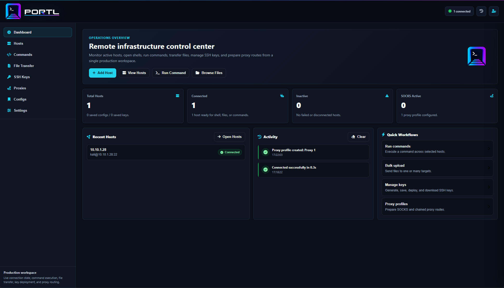
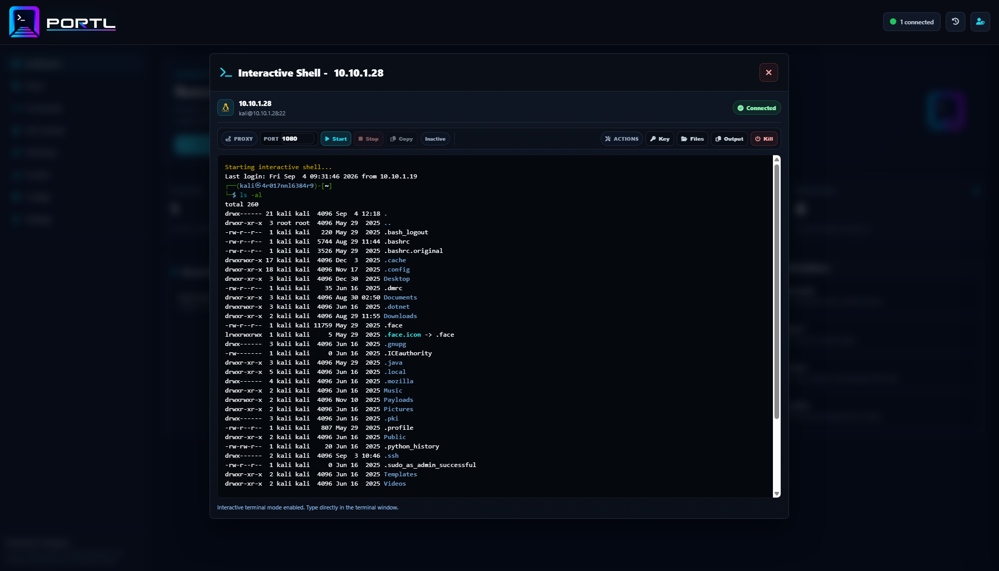

# Portl

<p align="center">
  
</p>

Portl controls remote operations from one browser-based platform. Use it to
manage SSH hosts, distribute keys across a domain, run one command against
multiple machines, browse remote files, launch interactive shells, manage SOCKS
proxy routes, and keep operational access in one focused workspace.

Portl release installs use a small dependency-free Python launcher. The launcher
checks the host, creates local secrets on first run, pulls the official Docker
image, and controls the Docker Compose stack.

## Features

- SSH host management with connection health tracking.
- One command across multiple selected hosts.
- One-click SSH key generation, storage, copy, download, and domain-wide distribution.
- Interactive browser shell sessions.
- Remote file browser with upload, download, rename, move, and delete actions.
- SOCKS proxy start, stop, and proxychains config copy support.
- Reusable proxy profiles for single proxy and chained proxy routes.
- Saved bulk connection configurations.
- Admin, operator, and viewer roles.
- Local activity feed focused on operational events.
- Docker Compose runtime with PostgreSQL persistence.

## Screenshots





Additional screenshots are available in `docs/screenshots/`.

## Requirements

- Docker with Docker Compose v2
- Python 3
- Access to `ghcr.io/h0wl3r/portl:latest`

## Install

Linux (installs into `/srv/portl`; sudo is requested automatically when needed):

```bash
curl -fsSL https://raw.githubusercontent.com/H0wl3r/portl/main/install.sh | sh && /usr/local/bin/portl start
```

macOS (installs into `~/.local/share/portl`):

```bash
curl -fsSL https://raw.githubusercontent.com/H0wl3r/portl/main/install.sh | sh && portl start
```

Windows PowerShell:

```powershell
iwr https://raw.githubusercontent.com/H0wl3r/portl/main/install.ps1 -UseB | iex; portl start
```

The install scripts download:

- `portl.py`
- `docker-compose.yml`
- a small `portl` command wrapper

They do not install Docker, modify system packages, remove files, or clone the
application source repository.

Portl starts at:

```text
http://localhost:5000
```

If `portl` is not found, add the installer's printed bin directory to your
`PATH`.

## Website And Wiki

This repository includes a static project website:

- `index.html` - public landing page with quick install commands.
- `wiki.html` - install, configuration, update, security, and troubleshooting wiki.
- `assets/site.css` - shared website styling.

Enable GitHub Pages for this repository and serve from the `main` branch root to
publish the site.

## First Run

On first run, the launcher creates `.env` with generated secrets if one does not
already exist. It also prints the initial login details:

```text
Username: admin
Password: generated-per-install-password
```

Portl uses those `.env` values to create the first admin account when the app
starts. The password is unique to the install and is not baked into the Docker
image.

Important settings:

```env
POSTGRES_DB=portl
POSTGRES_USER=portl
POSTGRES_PASSWORD=generated-postgres-password
PORTL_IMAGE=ghcr.io/h0wl3r/portl:latest
PORTL_AUTH_USERNAME=admin
PORTL_AUTH_PASSWORD=generated-admin-password
PORTL_SECRET_KEY=generated-secret-key
PORTL_DATA_ENCRYPTION_KEY=generated-data-encryption-key
SESSION_COOKIE_SECURE=false
MAX_UPLOAD_BYTES=67108864
MAX_REMOTE_READ_BYTES=16777216
SSH_KEEPALIVE_SECONDS=15
CONNECTION_HEALTH_CHECK_SECONDS=10
PORTL_PORT=5000
```

Keep `PORTL_DATA_ENCRYPTION_KEY` stable after first launch. Changing it prevents
Portl from decrypting previously saved passwords, proxy credentials, private
keys, and saved connection secrets.

For HTTPS deployments:

```env
SESSION_COOKIE_SECURE=true
```

## Commands

```bash
portl doctor    # Check Docker, Compose, .env, and port readiness
portl start     # Pull the configured image and start Portl
portl stop      # Stop and remove the Compose containers
portl restart   # Restart the existing containers
portl update    # Update launcher, Compose, and image, then restart
portl status    # Show Compose container status
portl logs      # Follow recent app logs
```

From a repository checkout, use the same commands through Python:

```bash
python portl.py doctor
python portl.py start
python portl.py update
```

## Docker Compose

Portl still uses a Compose file even when pulling the published Docker image.
The image contains the app; Compose defines how to run it.

| Service | Purpose |
| --- | --- |
| `app` | Flask, Socket.IO, SSH/session management, and the frontend. |
| `db` | PostgreSQL database for users, saved configs, keys, proxies, and session metadata. |
| `portl_db` | Persistent Docker volume for PostgreSQL data. |

Compose also defines ports, environment variables, health checks, dependency
order, restart policy, and persistent storage.

## Updating

For installed release deployments:

```bash
portl update
```

The update refreshes the installed launcher and Compose file, pulls the configured
image, and waits for the restarted app to become healthy. Existing `.env` settings
and database volumes are preserved. Default installations use public `main`;
pinned image versions use the corresponding release tag.

Use `portl update --image-only` to preserve local launcher and Compose files.
Source checkouts and custom image or Compose configurations update containers only.
Older installed launchers need one installer rerun after this feature is published;
after that, `portl update` also keeps the launcher current.

## Installer Overrides

On Linux, PORTL_SUDO_COMMAND defaults to `sudo` when not running as root.
Root shells run directly. Set `PORTL_SUDO_COMMAND="sudo -E"` to preserve the
environment, or set it to an empty string for a user-owned custom installation.
The system-installed command wrapper also requests elevation when needed.

Use overrides when testing another branch, hosting the launcher elsewhere, or
using a private release channel.

Linux/macOS:

```bash
PORTL_LAUNCHER_URL=https://example.com/portl.py \
PORTL_COMPOSE_URL=https://example.com/docker-compose.yml \
sh install.sh
```

Windows PowerShell:

```powershell
$env:PORTL_LAUNCHER_URL="https://example.com/portl.py"
$env:PORTL_COMPOSE_URL="https://example.com/docker-compose.yml"
.\install.ps1
```

Custom install locations:

```bash
PORTL_SUDO_COMMAND="" PORTL_INSTALL_DIR="$HOME/portl" PORTL_BIN_DIR="$HOME/.local/bin" sh install.sh
```

```powershell
$env:PORTL_INSTALL_DIR="$env:USERPROFILE\portl"
$env:PORTL_BIN_DIR="$env:USERPROFILE\bin"
.\install.ps1
```

## Uninstall

Preview cleanup on Windows or Linux:

```text
portl uninstall --dry-run
```

Remove Portl, including its saved database, hosts, users, SSH keys, and secrets:

```text
portl uninstall
```

The command lists what it will remove and requires you to type `DELETE PORTL`.
Use `portl uninstall --yes` only for an unattended removal. Docker must be running
and accessible. The Linux system wrapper requests sudo when necessary.

Cleanup includes containers, volumes and networks for the known `portl`,
`portl-dev`, and `portl-ci` Compose projects, projects identified by Portl app
containers, and the legacy `portl_ssh_manager_db` volume. It removes identifiable
Portl image tags and the PostgreSQL 16 Alpine image when unused by other containers.
Shared volumes or networks block uninstall; images used by other containers stay.
It does not prune Docker globally or delete images from GHCR.

Recognized installation files and wrappers are removed from the current install
and default locations for the current user (including old Linux wrappers).
Installers record custom command directories for cleanup. Unknown files, Git
checkouts, other users' installations, and unrecognized Docker resources remain.
Windows removes its dedicated user PATH entry and finishes deleting the command
wrapper after the command exits. Restart the terminal after uninstalling.

## Data And Backups

PostgreSQL data is stored in the Docker volume `portl_db`. Back up this volume
before migrating hosts or replacing the deployment.

The `.env` file is also required for recovery because it contains the encryption
key used for saved secrets.

## Security Notes

- Use strong values for `PORTL_AUTH_PASSWORD`, `PORTL_SECRET_KEY`,
  `PORTL_DATA_ENCRYPTION_KEY`, and `POSTGRES_PASSWORD`.
- Store `.env` securely and do not commit real secrets.
- Set `SESSION_COOKIE_SECURE=true` when serving Portl over HTTPS.
- Admin users can manage users and operate the workspace.
- Operator users can operate hosts, shells, files, keys, and proxies.
- Viewer users have read-only access.
- SSH host key checking is intentionally disabled for the current private-network
  operating model.

## Troubleshooting

Run checks:

```bash
portl doctor
```

Show service status:

```bash
portl status
```

Follow logs:

```bash
portl logs
```

If the configured port is already in use, set another port in `.env`:

```env
PORTL_PORT=5001
```

If Docker is installed but Portl will not start, confirm Docker Desktop or the
Docker Engine daemon is running.

## Project Layout

```text
index.html                                  Static project landing page
wiki.html                                   Static project wiki
assets/site.css                              Static website styling
assets/site.js                               Static website interactions
assets/Linux-Logo.png                       Linux install selector logo
assets/portal_logo.png                       Portl logo used by README
assets/portal_logo_tight.png                 Portl website logo
assets/portl_text_white.png                  Portl white text logo
assets/portl_text_white_tight.png            Portl website text logo
docs/screenshots/                           Optional product screenshots
portl.py                                    Dependency-free production launcher CLI
docker-compose.yml                          Runtime stack definition
install.sh                                  Linux/macOS bootstrap installer
install.ps1                                 Windows PowerShell bootstrap installer
```
